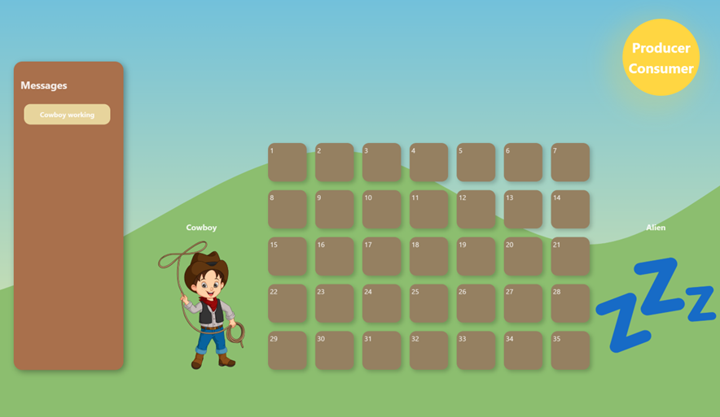
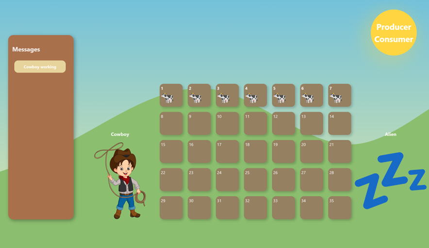
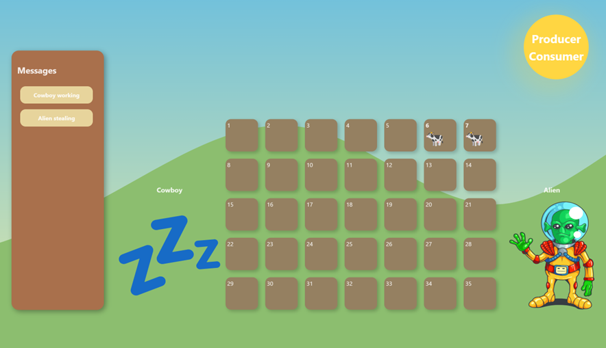
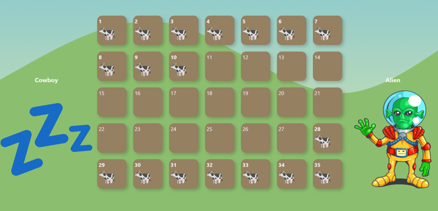
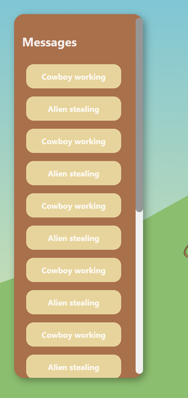

# Consumer - Producer App React + Vite

Esta pagina web Simula  el comportamiento  de un contenedor el cual es un buffer circular y acotado  es decir cuando llegue a la ultima casilla se regresa a  primera.

El desarrollo es un tipo juego, en el que el **productor** es en este caso el **vaquero**, el **consumidor** es un **alien**, el cual roba el **producto** que son **vacas**, las cuales estan en el **contenedor**, el **corral***.

- El productor:

	- coloca elementos 
	- para que el productor entre debe haber espacio libre 
	- coloca los elementos en orden 
	- se duerme con un time rondom 
	- al despertar intenta producir 
	- produce de de 3 a 10 elementos 

 - El consumidor :

	- retira elementos 
	- para que el consumidor entre debe haber elementos  
	- quita los elementos en orden 
	- se duerme con un time random 
	- al despertar intenta consumir
	- consume de 3 a 10 elementos 

## Screenshots

1. 🌱 Inicio del programa.

    

2. 🪴 Comienza a trbajar el prodctor.

    

3. 🌿 El cosumidor comienza a remover elementos.

    

4. ☘️ El productor termino y comenzó desde el inicio.

    

5. 🍃 Se puede ver la lista de los estados.

    

🧑🏻‍🏫 Profesor: 
JULIO ESTEBAN VALDES LOPEZ.

🏫 Universidad de Guadalajara.

--------------------------------------------------

Edwin Cornejo 👨🏻‍💻💚.